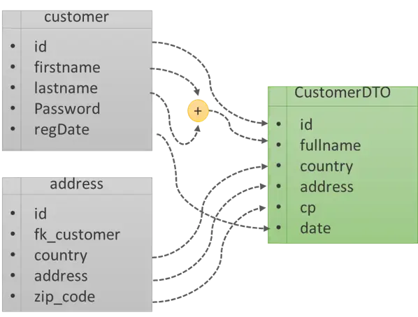
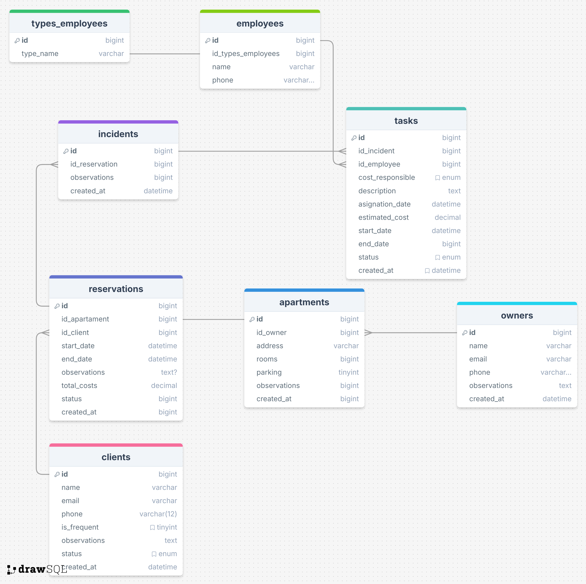
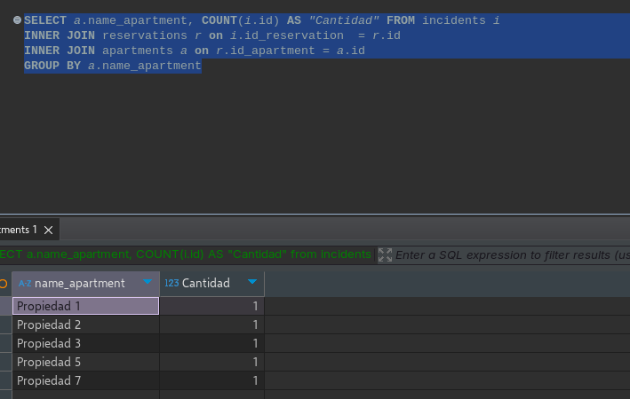
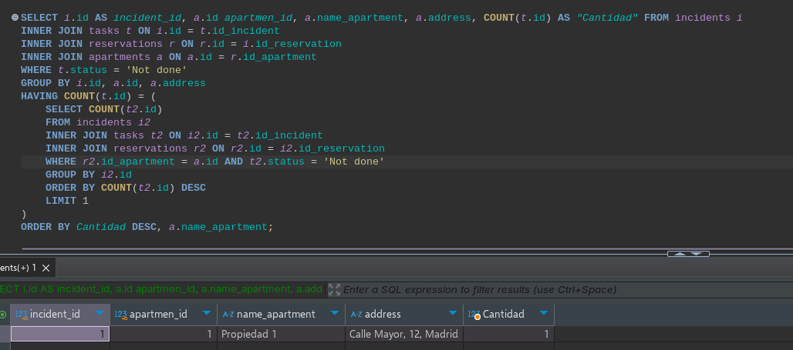
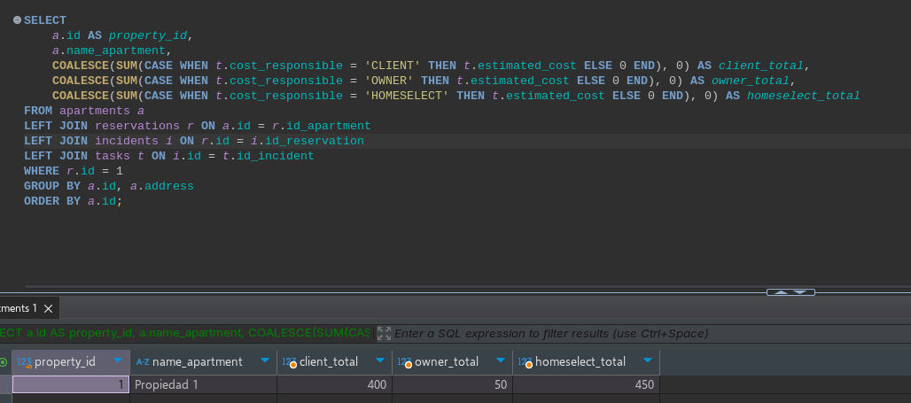
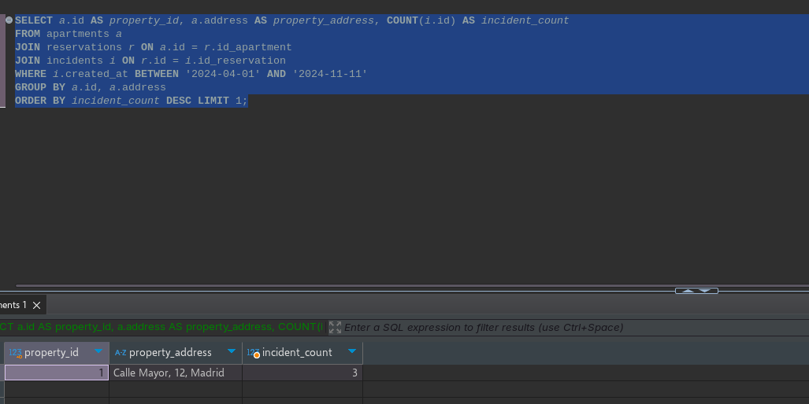
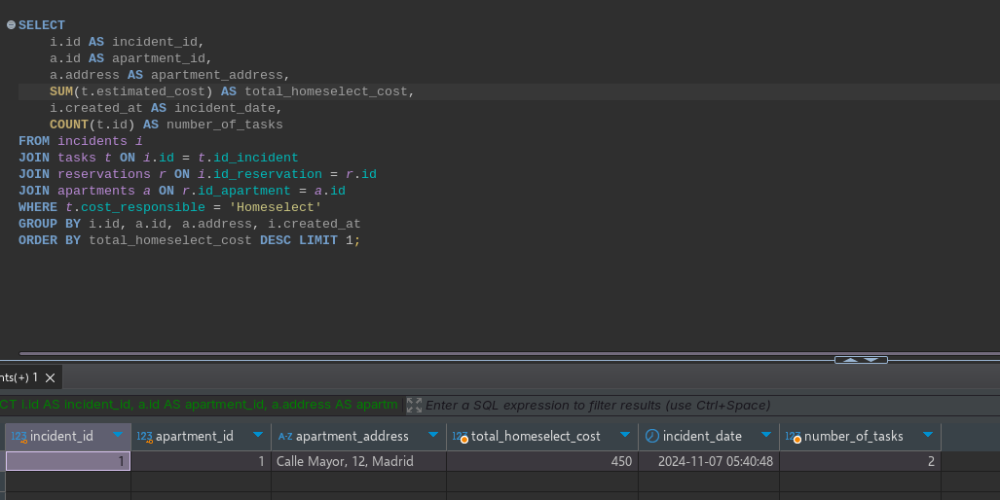
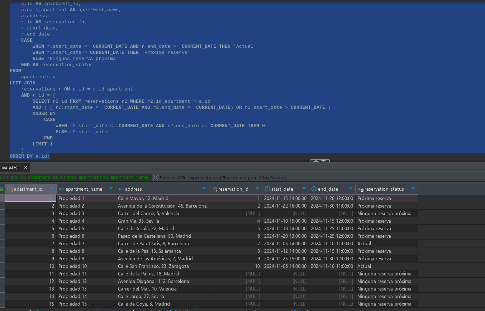

# Template API usign Laravel V. 11

## Integrated technologies

This api has the following integrated technologies

- [Laravel 11](https://laravel.com/docs/11.x/releases)
- [Laravel-permission](https://spatie.be/docs/laravel-permission/v6/introduction)
- [JWT-Authentication](https://github.com/tymondesigns/jwt-auth)

> Important have installed php 8.2

## Setting Up the Project

1. Run the following command to install the project dependencies using Composer:

```
composer install
```
This command will download and install all the required dependencies for the project.

2. Create a Copy of the .env.example File

Create a copy of the .env.example file and rename it to .env. This file will contain environment-specific settings for the project. It is important to pay close attention to the following fields for the configuration of the database

```
DB_CONNECTION=mysql
DB_HOST=127.0.0.1
DB_PORT=3306
DB_DATABASE=database_name
DB_USERNAME=database_user
DB_PASSWORD=database_password
```

_In linux you can use the following command to create a copy of the file_

```
cp .env.example .env
```

3. Generate the Application Key

Run the following command to generate a new application key:

```
php artisan key:generate
```
4. Run Database Migrations with Default Data

Run the following command to execute the database migrations and seed the database with default data:

```
php artisan migrate:fresh --seed
```

This command will create the database tables and populate them with default data.

5. Generate the JWT Secret

Finally, run the following command to generate a secret key for JSON Web Tokens (JWT):

```
php artisan jwt:secret
```

This command will generate a new secret key and store it in the .env file.


That's it! Your project should now be set up and ready to use.


Now all we have to do is execute the following command to run it locally

```
php artisan serve
```

## API Documentation

### Postman
To perform various queries to the API endpoints, you can use the following .json files:

- [Collections](./documentation/postman/Collections.json)
- [Environment](./documentation/postman/Homeselect.postman_environment.json)

If you're unsure how to use these JSON files, please refer to this guide: [Importing and exporting Overview](https://learning.postman.com/docs/getting-started/importing-and-exporting/importing-and-exporting-overview/)

The goal is to import both the collection and the environment to enable you to conduct different tests more efficiently.

For the login endpoint, the following script is added:

```js
// post-response
var data =  pm.response.json();
pm.environment.set ("token", data['access_token']);
```

This script allows you to save the session token, enabling you to access all endpoints that require authentication.


### Home select test

#### PHP

##### ¿Para qué sirve la función explode?

La función explode en PHP se utiliza  para dividir una cadena de texto en un Array basandose en un delimitador especificado, ejemplo:

```php
// Cadena de ejemplo
$cadena = "manzana,naranja,plátano,fresa";

// Usar explode para dividir la cadena en un array
$frutas = explode(",", $cadena);
print_r($frutas);

// ["manzana", "naranja", "plátano", "fresa"]
```

##### ¿Qué diferencias hay entre POST, PUT, DELETE?.

POST, PUT y DELETE son métodos HTTP utilizados en APIs RESTful para realizar diferentes operaciones en los recursos

- POST
    
    Se utiliza para crear un nuevo recurso, este método utiliza un body el cual contiene la información de este nuevo registro.
    
- PUT
    
    La url representa un recurso en especifico `/entpoint/:id` contiene un body que normalmente es usado para actualizar la información del registro especificado.
    
- DELETE
    
    Este método generalmente no cuenta con un cuerpo, y se utiliza para eliminar un recurso en especifico

##### ¿Qué es un DTO? de un ejemplo de cómo usarlo

Objeto de Transferencia de Datos es un patrón de diseño utilizado para transferir datos entre subsistemas de una aplicación. Lo que propone este patrón es poder transmitir datos sin hacer completo uso de las entidades de tal forma que se pueda controlar la información brindando mayor flexibilidad y seguridad de esta, esto teniendo en cuenta que no afecta la capa de servicio o datos, y solamente se utilizaría cómo lectura.



##### ¿Para qué sirve el siguiente código?

```php
if (empy($variable)){}
```

Primeramente el código está errado porque la función `empy` no existe dentro del entorno php.

Ahora teniendo en cuenta que se trate de la función `empty` esta se utiliza para definir que la variable `$variable` se encuentre vacía, dentro de este contexto “vacía” significa lo siguiente:
- No está definida
- Es null
- Es una cadena vacía ("")
- Es un array vacío
- Es el número 0 (como integer o string)
- Es el valor booleano false

Ahora si se cumple la condición se ejecutará el código que se encuentre dentro de `{}`

##### Ejercicio 5

Necesitamos una función php el cual se pase el código postal y nos retorne el mismo código postal con lo siguiente, código postal sin espacios (no puede tener ningún espacio en ninguna posición), si el código postal tiene menos de 5 números entonces completar con 0 al inicio, es decir nos pasan el código 894 entonces deberá retornar 00894, si tiene más de 5 números no agregamos ceros

```php
function FormatPostalCode($code) {
    
    if(!is_numeric($code)) return -1; // Si no se trata de un número

    $code = str_replace(' ', '', $code); // Eliminar todos los espacios
    $code = preg_replace('/[^0-9]/', '', $code); // Asegurarse de que solo contiene dígitos
        
    if (strlen($code) < 5) {
		    // str_pad ajusta una cadena a una longitud específica, rellenando la cadena con caracteres adicionales si es necesario
		    // en este caso STR_PAD_LEFT indica que se completará hacia la izquierda con el caracter '0'
        $code = str_pad($code, 5, '0', STR_PAD_LEFT);
    }
    return $code;
}
echo FormatPostalCode('894'); // 00894
```

##### Ejercicio 6

Tenemos el siguiente problema, actualmente tenemos conexión con una API de reservas, esta API nos hace un llamado de crear reserva, nosotros procesamos la solicitud y posteriormente se crea la reserva en nuestro sistema. El problema es que en nuestro servidor entre las 2am y 3am tiene mucha carga y si justo nos hacen un llamado a esta hora esa reserva no va a quedar en nuestro sistema. ¿Qué solución plantearías? explica con tus propias palabras

Para este inconveniente plantearía 2 alternativas, ¿por qué 2?, siempre es bueno tener alternativas, en muchas ocasiones por temas de costos, tiempo o algún otro factor. Así que bien.

1. Realizar la implementación de un auto-scalling al servidor para aumentar su capacidad de carga durante las “horas pico” lo que puede garantizar además que las solicitudes no fallen. Esta alternativa tendría que ser analizada más a nivel de arquitectura dado el caso que la instancia del servidor sea manejada en alguna capa cloud (Amazon, Google, Oracle, etc) que ya proporcionan servicios que se ajustan a la necesidad que se plantea en estos momentos.

2. Realizar la implementación de colas o “Queues”, estas se pueden emplear para tareas que requieren de mucho tiempo de procesamiento [lease Queues en laravel](https://laravel.com/docs/11.x/queues) para tener una idea, Esta solución permitiría devolverle al usuario una respuesta mientras que su solicitud se posiciona en espera mientras en el servidor se están procesando más tareas y al momento de llegar su turno, se procesará la información.

Aquí el una solución completamente funcional y eficiente dependerá de muchos factores, cómo por ejemplo realizar una arquitectura escalable y flexible, que permita el buen procesamiento de la información a medida que esta crece o que existan leves cambios. Por otro lado interviene el tema de costos, debido a que de ser completamente necesario elevar un poco el comportamiento del servidor la primera opción podría ser muy buena candidata sin tener necesariamente que invertir tiempo en desarrollo de otras funcionalidades.

##### Ejercicio 7

Modelo entidad relación para el caso de prueba



##### Ejercicio 9

```sql
SELECT a.name_apartment, COUNT(i.id) AS "Cantidad" FROM incidents i 
INNER JOIN reservations r on i.id_reservation  = r.id 
INNER JOIN apartments a on r.id_apartment = a.id
GROUP BY a.name_apartment
```




##### Ejercicio 10

```sql
SELECT i.id AS incident_id, a.id apartmen_id, a.name_apartment, a.address, COUNT(t.id) AS "Cantidad" FROM incidents i 
INNER JOIN tasks t ON i.id = t.id_incident
INNER JOIN reservations r ON r.id = i.id_reservation 
INNER JOIN apartments a ON a.id = r.id_apartment 
WHERE t.status = 'Not done'
GROUP BY i.id, a.id, a.address
HAVING COUNT(t.id) = (
    SELECT COUNT(t2.id)
    FROM incidents i2
    INNER JOIN tasks t2 ON i2.id = t2.id_incident
    INNER JOIN reservations r2 ON r2.id = i2.id_reservation
    WHERE r2.id_apartment = a.id AND t2.status = 'Not done'
    GROUP BY i2.id
    ORDER BY COUNT(t2.id) DESC
    LIMIT 1
)
ORDER BY Cantidad DESC, a.name_apartment;
```

- Utilizamos `COUNT(t.id)` para contar las tareas no solucionadas por incidencia.
- Agrupamos por incidencia y apartamento usando `GROUP BY`.
- Usamos una subconsulta en la cláusula `HAVING` para comparar el conteo de tareas no solucionadas de cada incidencia con el máximo conteo para ese apartamento.
- La subconsulta encuentra el máximo número de tareas no solucionadas para cada apartamento.
- Finalmente, ordenamos los resultados por el número de tareas no solucionadas en orden descendente y luego por el ID del apartamento.


##### Ejercicio 11

```sql
SELECT 
    a.id AS property_id,
    a.name_apartment,
    COALESCE(SUM(CASE WHEN t.cost_responsible = 'CLIENT' THEN t.estimated_cost ELSE 0 END), 0) AS client_total,
    COALESCE(SUM(CASE WHEN t.cost_responsible = 'OWNER' THEN t.estimated_cost ELSE 0 END), 0) AS owner_total,
    COALESCE(SUM(CASE WHEN t.cost_responsible = 'HOMESELECT' THEN t.estimated_cost ELSE 0 END), 0) AS homeselect_total
FROM apartments a
LEFT JOIN reservations r ON a.id = r.id_apartment 
LEFT JOIN incidents i ON r.id = i.id_reservation
LEFT JOIN tasks t ON i.id = t.id_incident
WHERE r.id = 1
GROUP BY a.id, a.address 
ORDER BY a.id;
```



##### Ejercicio 12
SQL para obtener la propiedad que más incidencias se le han reportado entre el `2024-04-01` al `2024-11-01`

```sql
SELECT a.id AS property_id, a.address AS property_address, COUNT(i.id) AS incident_count
FROM apartments a
JOIN reservations r ON a.id = r.id_apartment 
JOIN incidents i ON r.id = i.id_reservation
WHERE i.created_at BETWEEN '2024-04-01' AND '2024-11-11'
GROUP BY a.id, a.address
ORDER BY incident_count DESC LIMIT 1;
```
Se realizó una pequeña modificación debido a que no se contaba con registros de esas fechas



##### Ejercicio 13
SQL para obtener el costo asumido más alto por homeselect del total de una
incidencia (recuerde que una incidencia puede tener varias tareas que son las que
tienen el asumido por).

```sql
SELECT 
    i.id AS incident_id,
    a.id AS apartment_id,
    a.address AS apartment_address,
    SUM(t.estimated_cost) AS total_homeselect_cost,
    i.created_at AS incident_date,
    COUNT(t.id) AS number_of_tasks
FROM incidents i
JOIN tasks t ON i.id = t.id_incident
JOIN reservations r ON i.id_reservation = r.id
JOIN apartments a ON r.id_apartment = a.id
WHERE t.cost_responsible = 'Homeselect'
GROUP BY i.id, a.id, a.address, i.created_at
ORDER BY total_homeselect_cost DESC LIMIT 1;
```

- Se realiza la suma del costo estimado teniendo en cuenta el número de tareas asociadas a esa incidencia, en las que `Homeselect` asume los costos.




##### Ejercicio 14

SQL para obtener el código de la reserva actual o el código de la próxima reserva de
cada apartamento, nos debe entregar nombre del apartamento, fecha de inicio y
fecha final de la reserva. Aclaración: si el apartamento el día de hoy está ocupado,
debe entregar los datos de esa reserva actual; si el apartamento el día de hoy está
vacío, debe entregar los datos de la próxima reserva.


```sql
SELECT 
    a.id AS apartment_id,
    a.name_apartment AS apartment_name,
    a.address,
    r.id AS reservation_id,
    r.start_date,
    r.end_date,
    CASE 
        WHEN r.start_date <= CURRENT_DATE AND r.end_date >= CURRENT_DATE THEN 'Actual'
        WHEN r.start_date > CURRENT_DATE THEN 'Próxima reserva'
        ELSE 'Ninguna reserva próxima'
    END AS reservation_status
FROM 
    apartments a
LEFT JOIN 
    reservations r ON a.id = r.id_apartment 
    AND r.id = (
        SELECT r2.id FROM reservations r2 WHERE r2.id_apartment = a.id
        AND ( ( r2.start_date <= CURRENT_DATE AND r2.end_date >= CURRENT_DATE) OR r2.start_date > CURRENT_DATE )
        ORDER BY 
            CASE 
                WHEN r2.start_date <= CURRENT_DATE AND r2.end_date >= CURRENT_DATE THEN 0
                ELSE r2.start_date
            END
        LIMIT 1
    )
ORDER BY a.id;
```

- Tecnicamente el proceso es validar inicialmente cuales son las fechas establecidas de las reserva, si en el momento hay reserva, existe una próxima fecha, o definitivamente nose tiene ningúna.

